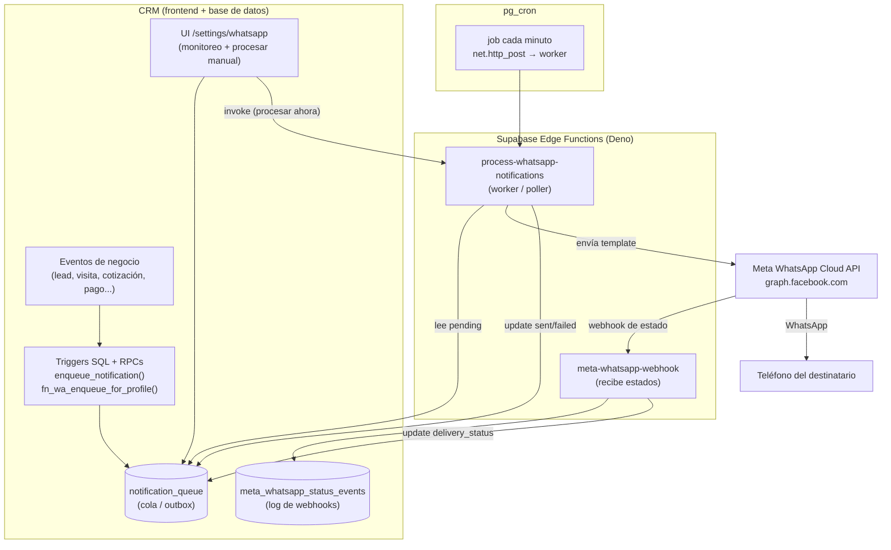

# Módulo "Notificaciones de WhatsApp" — Documentación completa y Guía de Portabilidad

**Proyecto origen:** CRM Innovar App (Supabase `xdzbjptozeqcbnaqhtye`)
**Fecha:** 26 de mayo de 2026
**Objetivo de este documento:** entender a fondo la lógica del módulo, documentarla, y dar una guía paso a paso para replicarlo en otro CRM / aplicación propia.
**Audiencia:** dueño no técnico (Parte 1 y 2) + desarrollador que implementará el port (Parte 3 en adelante).

---

> ### ⚠️ Nota importante sobre la fuente de esta documentación
>
> Esta documentación se construyó leyendo **el código fuente real, las migraciones SQL, el esquema y los informes** del repositorio Innovar. **No** se pudo consultar la base de datos de producción en vivo desde este entorno (la red de este entorno está aislada y el conector Supabase disponible apunta a otros proyectos, no al de Innovar). Por eso, todo lo que describe **código y migraciones es exacto**, pero el **estado vivo** (versión exacta de la función desplegada, plantillas realmente aprobadas en Meta hoy, lista actual de cron jobs) debe confirmarse con dos comandos que se incluyen al final (Apéndice A). Donde hay diferencias conocidas entre el código y producción, lo marco con ⚠️.

---

# PARTE 1 — Resumen ejecutivo (sin tecnicismos)

El módulo de **Notificaciones de WhatsApp** es el sistema que permite que el CRM **envíe mensajes de WhatsApp automáticamente** a clientes y al equipo interno, sin que nadie tenga que escribirlos a mano, y que además **registre si esos mensajes se entregaron y se leyeron**.

Funciona como un **buzón de salida** (en inglés, *outbox*). Cuando en el CRM pasa algo importante —se registra un lead nuevo, se agenda una visita, el cliente acepta una cotización, se verifica un pago, etc.— el sistema **deja una "carta" en ese buzón**. Cada minuto, un "cartero automático" revisa el buzón, toma las cartas pendientes y las envía por WhatsApp usando la **API oficial de WhatsApp Business de Meta**. Cuando Meta confirma que el mensaje llegó o fue leído, esa confirmación vuelve y queda guardada.

Las ventajas de hacerlo así (y no enviar el mensaje "en el momento exacto" del evento):

- **Nada se pierde:** si WhatsApp o Meta están caídos un momento, la carta queda en el buzón y se reintenta.
- **No se duplica:** cada carta tiene una "huella" única (`dedup_key`); si el mismo evento intenta encolar dos veces, solo se envía una.
- **Es auditable:** queda registro de cada mensaje, su estado, sus reintentos y los errores.
- **Usa plantillas oficiales aprobadas por Meta**, así los mensajes no caen en spam.

El equipo puede ver todo esto en la pantalla **Configuración → Notificaciones WhatsApp**, donde aparece la cola de mensajes con su estado (pendiente, enviado, entregado, leído, fallido) y un botón para "procesar ahora" manualmente.

**En una frase:** es un sistema de mensajería automática por WhatsApp basado en una *cola de salida* en la base de datos + un *trabajador* que la vacía cada minuto enviando a Meta + un *webhook* que recibe las confirmaciones de entrega.

---

# PARTE 2 — Cómo funciona, explicado con claridad

El módulo tiene **6 piezas** que trabajan juntas. Esta es la versión clara; la versión técnica con código está en la Parte 3.

1. **La cola (`notification_queue`)** — la tabla "buzón de salida" en la base de datos. Cada fila es un mensaje por enviar, con el teléfono del destinatario, qué plantilla usar y con qué datos rellenarla.

2. **Los disparadores (triggers y funciones SQL)** — son las reglas que dicen *"cuando pase X, dejá una carta en el buzón"*. Por ejemplo: "cuando se cree un lead, encolá un mensaje de bienvenida". Estos disparadores viven dentro de la base de datos y se activan solos.

3. **El trabajador (`process-whatsapp-notifications`)** — un pequeño programa (Edge Function de Supabase) que cada minuto toma hasta 25 mensajes pendientes y los envía a Meta. Si uno falla, lo marca como fallido y guarda el motivo; reintenta hasta 3 veces.

4. **El cartero programado (cron job)** — la tarea programada que "despierta" al trabajador cada minuto.

5. **El webhook (`meta-whatsapp-webhook`)** — la puerta de entrada por donde Meta avisa *"este mensaje se entregó / se leyó / falló"*. Esas confirmaciones se guardan y actualizan el estado de la cola.

6. **La pantalla de monitoreo** — la interfaz en `/settings/whatsapp` donde el equipo ve la cola, filtra por estado y puede forzar el envío.

### El recorrido de un mensaje, de principio a fin

```
Evento en el CRM
   (ej: cliente acepta cotización)
        │
        ▼
[ Trigger SQL ]  ──► inserta una fila en notification_queue (status = 'pending')
        │
        ▼
[ Cron cada minuto ] ──► despierta al trabajador
        │
        ▼
[ process-whatsapp-notifications ]
   1. toma hasta 25 filas 'pending' con menos de 3 intentos
   2. las marca 'processing'
   3. arma el mensaje según la plantilla
   4. lo envía a la API de Meta (Graph API)
   5. marca 'sent' (con el ID de Meta) o 'failed' (con el error)
        │
        ▼
[ Meta envía el WhatsApp al teléfono del destinatario ]
        │
        ▼
[ Meta llama de vuelta al webhook ] ──► meta-whatsapp-webhook
   - valida la firma (seguridad)
   - guarda el evento en meta_whatsapp_status_events
   - actualiza notification_queue.delivery_status = 'delivered' / 'read' / 'failed'
        │
        ▼
[ Pantalla /settings/whatsapp muestra todo el recorrido ]
```

---

# PARTE 3 — Arquitectura técnica detallada

Patrón arquitectónico: **Transactional Outbox + Worker (poller) + Webhook de estados.** Proveedor de mensajería: **Meta WhatsApp Cloud API (Graph API)**.

## 3.1 Diagrama de componentes



## 3.2 Componente 1 — Las tablas

### Tabla `notification_queue` (la cola / outbox)

⚠️ **Importante:** el archivo `db/supabase_schema.sql` del repo muestra una versión **antigua y reducida** de esta tabla. Las migraciones posteriores (Fase 3 y 4) agregaron columnas que **sí existen en producción** y que el código usa. La estructura **real y completa** (reconstruida desde los `INSERT` de las migraciones 026/035b/037/038 y del worker) es:

| Columna | Tipo | Para qué sirve |
|---|---|---|
| `id` | UUID PK | Identificador del mensaje |
| `event_type` | TEXT | Tipo de evento que lo originó (ej. `lead_welcome`, `quotation_accepted`, `project.fully_paid`) |
| `event_reference_id` | TEXT | ID del registro que disparó el evento |
| `entity_type` | TEXT | Entidad relacionada (`quotation`, `visit`, `project`, `payment`...) |
| `entity_reference_id` | TEXT | ID de esa entidad |
| `recipient_type` | TEXT | `client`, `admin`, `designer`, `staff` |
| `recipient_reference_id` | TEXT | ID del cliente/profile destinatario |
| `recipient_name` | TEXT | Nombre para mostrar |
| `recipient_phone` | TEXT | Teléfono destino (en Colombia llega sin prefijo país) |
| `channel` | TEXT | `whatsapp` |
| `provider` | TEXT | `meta_whatsapp` |
| `template_name` | TEXT | Nombre de la plantilla aprobada en Meta |
| `template_language` | TEXT | Código de idioma (`es`) |
| `template_parameters` | JSONB | Valores para las variables `{{1}}`, `{{2}}`... de la plantilla |
| `payload` | JSONB | Metadatos del evento (para auditoría/depuración) |
| `dedup_key` | TEXT | Huella única anti-duplicados (índice UNIQUE parcial) |
| `status` | TEXT | `pending` · `processing` · `sent` · `failed` · `skipped` |
| `delivery_status` | TEXT | Estado reportado por Meta: `accepted` · `sent` · `delivered` · `read` · `failed` |
| `provider_message_id` | TEXT | ID del mensaje en Meta (`wamid.*`) |
| `error_message` / `failed_reason` | TEXT | Diagnóstico de error |
| `attempt_count` | INTEGER | Reintentos (máx 3) |
| `processing_at` `sent_at` `failed_at` `delivered_at` `read_at` `last_delivery_status_at` | TIMESTAMPTZ | Cronología |
| `created_at` `updated_at` | TIMESTAMPTZ | Timestamps |

Índice clave de idempotencia:

```sql
CREATE UNIQUE INDEX notification_queue_dedup_key_uniq
  ON public.notification_queue (dedup_key)
  WHERE dedup_key IS NOT NULL;
```

### Tabla `meta_whatsapp_status_events` (log de webhooks de Meta)

```sql
CREATE TABLE public.meta_whatsapp_status_events (
  id                  UUID PRIMARY KEY DEFAULT gen_random_uuid(),
  provider_message_id TEXT NOT NULL,         -- wamid.* → cruza con notification_queue
  recipient_id        TEXT,
  status              TEXT,                   -- sent | delivered | read | failed
  status_timestamp    TIMESTAMPTZ,
  raw_payload         JSONB,                  -- payload crudo de Meta (auditoría)
  errors              JSONB,
  conversation        JSONB,                  -- info de conversación/pricing de Meta
  pricing             JSONB,
  created_at          TIMESTAMPTZ DEFAULT NOW()
);
```

Ambas tablas tienen **RLS activado**; los usuarios autenticados pueden leerlas (para el monitoreo). El worker y el webhook escriben con la **service role key** (saltan RLS).

## 3.3 Componente 2 — El encolado (cómo se llena la cola)

Hay **dos helpers SQL centrales** que el resto del sistema reutiliza para no duplicar lógica. (Su firma se reconstruyó desde el uso real en las migraciones; el cuerpo exacto vive en producción — ver Apéndice A para extraerlo).

**`enqueue_notification(...)`** — encolado genérico (típicamente para clientes). Inserta en `notification_queue` calculando un `dedup_key` automático. Firma según uso:

```sql
PERFORM public.enqueue_notification(
  p_event_type            TEXT,   -- 'quotation_payment_request'
  p_event_reference_id    TEXT,   -- NEW.id
  p_entity_type           TEXT,   -- 'quotation'
  p_entity_reference_id   TEXT,   -- NEW.id
  p_recipient_type        TEXT,   -- 'client'
  p_recipient_reference_id TEXT,  -- client.id
  p_recipient_name        TEXT,
  p_recipient_phone       TEXT,
  p_template_name         TEXT,   -- 'payment_request_v1'
  p_template_language     TEXT,   -- 'es'
  p_template_parameters   JSONB,  -- jsonb_build_array('Juan', '...')
  p_payload               JSONB
);
```

**`fn_wa_enqueue_for_profile(...)`** — wrapper para **staff interno** (admin/comercial/diseñador). Antes de encolar verifica: que el `profile` esté activo (`is_active`), que tenga `whatsapp_phone`, y que la **preferencia de notificación** del usuario (`notification_preferences -> 'whatsapp' -> <pref_key>`) esté habilitada. Firma según uso:

```sql
PERFORM public.fn_wa_enqueue_for_profile(
  p_profile_id          UUID,    -- destinatario interno
  p_event_type          TEXT,    -- 'quotation_accepted'
  p_pref_key            TEXT,    -- 'wa_quotation_accepted' (llave de preferencia)
  p_entity_type         TEXT,    -- 'quotation'
  p_entity_reference_id UUID,    -- NEW.id
  p_template_name       TEXT,    -- 'admin_quotation_accepted_v1'
  p_template_parameters JSONB,   -- jsonb_build_array(...)
  p_payload             JSONB
);
```

> También se menciona un tercer helper `fn_profile_wants_wa(profile, pref_key)` que encapsula el chequeo de preferencia.

Algunos triggers/RPC insertan **directamente** en `notification_queue` (no usan el helper) cuando necesitan setear el `dedup_key` a mano para idempotencia fina — por ejemplo `recalc_project_balance_due`, `verify_payment`, `reject_payment`, `expire_accepted_quotations_scan`. Todos usan `ON CONFLICT (dedup_key) DO NOTHING`.

### Catálogo completo de eventos → plantillas

Esta es la lista de **todos los puntos del CRM que encolan WhatsApp**, con el disparador (origen) y la plantilla Meta que usan:

| # | Evento de negocio | Disparador (SQL) | Destinatario | Plantilla Meta | Variables |
|---|---|---|---|---|---|
| 1 | Lead nuevo creado | trigger `trg_notify_lead_followup_flow` (mig 014) | Cliente | `welcome_lead_v1` | {{1}}=nombre |
| 2 | Lead nuevo → link de agenda | mismo trigger (mig 014) | Cliente | `booking_link_v1` | {{1}}=nombre, {{2}}=URL, {{3}}=comercial |
| 3 | Visita asignada al comercial | trigger `trg_notify_visit_assigned_admin` (mig 026) | Admin/comercial | `visit_assigned_admin_v1` | cliente, fecha, hora, dirección |
| 4 | Recordatorio 24h (cliente) | cron `wa-recordatorio-24h-daily` (existente) | Cliente | `recordatorio24hantes` | (genérico) |
| 5 | Recordatorio 24h (interno) | cron `visit-reminders-24h-internal` (mig 026) | Comercial | `visit_reminder_24h_internal_v1` | hora, cliente, dirección, tel, servicios |
| 6 | Recordatorio 2h (cliente) | cron `visit-reminders-2h` (mig 026) | Cliente | `visit_reminder_2h_client_v1` | nombre, hora |
| 7 | Recordatorio 2h (interno) | cron `visit-reminders-2h` (mig 026) | Comercial | `visit_reminder_2h_internal_v1` | hora, cliente, dirección, tel |
| 8 | Resumen post-visita | mig 028 (`visit_summary`) | Cliente | `visit_summary_client_v1` | nombre, plazo_horas |
| 9 | Cliente acepta cotización → pide pago | trigger `fn_notify_quotation_acceptance` (mig 035b) | Cliente | `payment_request_v1` | nombre, banco, cuenta, titular, anticipo |
| 10 | Cliente acepta cotización (aviso) | `fn_notify_quotation_acceptance` (mig 035b) | Admin | `admin_quotation_accepted_v1` | admin, cliente, n° cotización |
| 11 | Cliente pide ajustes | `fn_notify_quotation_rejection` (mig 035b) | Admin | `admin_quotation_adjustments_v1` | admin, cliente, n°, motivo |
| 12 | Cliente rechaza | `fn_notify_quotation_rejection` (mig 035b) | Admin | `admin_quotation_rejected_v1` | admin, cliente, n°, motivo |
| 13 | Comprobante de pago rechazado | RPC `reject_payment` (mig 037) | Cliente | `payment_proof_rejected_v1` | nombre, n° cotización, motivo, link reintento |
| 14 | Proyecto: diseñador asignado | RPC `verify_payment` (mig 037) | Diseñador | `project_assigned_designer_v1` | nombre diseñador, cliente, path proyecto |
| 15 | Proyecto totalmente pagado | fn `recalc_project_balance_due` (mig 037) | Cliente | `project_fully_paid_v1` | nombre, nombre proyecto |
| 16 | Cotización enviada al cliente | RPC de envío de cotización (mig 035a, evento `quotation_sent`) | Cliente | `quotation_sent_v1` (V1) / `quotation_v2_sent_v1` (revisión V2) | cliente, n° cotización, link `/c/<short_code>` |
| 17 | Cotización aceptada expiró sin pago | cron `slice3-expire-accepted-quotations-daily` (mig 038) | Admin | `admin_quotation_expired_v1` | admin, cliente, n°, días vencida |

> Eventos adicionales referenciados en informes de negocio (pago recibido, tarea asignada, cambio de estado de proyecto, encuesta post-entrega) corresponden a las plantillas "legacy" de producción listadas en §3.9.

## 3.4 Componente 3 — El worker `process-whatsapp-notifications`

Edge Function en Deno (TypeScript). Archivo: `supabase/functions/process-whatsapp-notifications/index.ts`. Lógica:

1. **Disparo:** POST con body `{ dry_run: boolean, limit: number }`. Lo llama el cron cada minuto (`{dry_run:false, limit:25}`) o la UI manualmente.
2. **Auth:** `verify_jwt: true`. El llamador necesita la service role key (cron) o la sesión del admin (UI).
3. **Reclamar lote:** lee de `notification_queue` las filas `status='pending'` con `attempt_count < 3`, ordenadas por `created_at ASC`, hasta `limit`.
4. **Lock optimista:** marca esas filas como `processing` (con `processing_at`).
5. **Por cada fila:** busca la plantilla en un **registro de plantillas** (`TEMPLATE_REGISTRY`), arma el cuerpo del mensaje, normaliza el teléfono a formato internacional, y hace POST a la Graph API de Meta.
6. **Resultado:**
   - Éxito → `status='sent'`, guarda `provider_message_id` (el `wamid.*` de Meta), `sent_at`, limpia errores.
   - Falla → `status='failed'`, guarda `error_message` / `failed_reason`, incrementa `attempt_count`.
7. **`dry_run`:** valida que la plantilla exista en el registro sin tocar Meta ni mutar la cola (útil para pruebas).

Constantes clave del worker:

```ts
const META_GRAPH_VERSION = "v21.0";
const COUNTRY_CODE = "57"; // Colombia: los teléfonos llegan sin prefijo
```

El **registro de plantillas** mapea cada `template_name` a un "builder" que arma los `components` del mensaje. El helper `bodyBuilder(name, arity)` soporta plantillas de N variables de texto, y acepta `template_parameters` tanto como array (`["a","b"]`) como objeto (`{"1":"a","2":"b"}`):

```ts
function bodyBuilder(name: string, arity: number): TemplateBuilder {
  return (params) => {
    const values: string[] = [];
    if (Array.isArray(params)) {
      for (let i = 0; i < arity; i++) values.push(String(params[i] ?? ""));
    } else {
      for (let i = 1; i <= arity; i++) values.push(String(params[String(i)] ?? ""));
    }
    return {
      name,
      language: { code: "es" },
      components: [{ type: "body", parameters: values.map((text) => ({ type: "text", text })) }],
    };
  };
}

const TEMPLATE_REGISTRY = {
  welcome_lead_v1: bodyBuilder("welcome_lead_v1", 1),
  booking_link_v1: bodyBuilder("booking_link_v1", 3),
  visit_assigned_admin_v1: bodyBuilder("visit_assigned_admin_v1", 4),
  visit_reminder_24h_internal_v1: bodyBuilder("visit_reminder_24h_internal_v1", 5),
  visit_reminder_2h_client_v1: bodyBuilder("visit_reminder_2h_client_v1", 2),
  visit_reminder_2h_internal_v1: bodyBuilder("visit_reminder_2h_internal_v1", 4),
  visit_summary_client_v1: bodyBuilder("visit_summary_client_v1", 2),
  payment_proof_rejected_v1: bodyBuilder("payment_proof_rejected_v1", 4),
  project_assigned_designer_v1: bodyBuilder("project_assigned_designer_v1", 3),
  project_fully_paid_v1: bodyBuilder("project_fully_paid_v1", 2),
  quotation_v2_sent_v1: bodyBuilder("quotation_v2_sent_v1", 3),
  admin_quotation_expired_v1: bodyBuilder("admin_quotation_expired_v1", 4),
};
```

Normalización de teléfono (Colombia, código país 57):

```ts
function normalizePhoneForMeta(phone: string): string {
  const digits = phone.replace(/[^0-9]/g, "");
  if (digits.startsWith("57") && digits.length === 12) return digits; // ya tiene prefijo
  if (digits.length === 10) return "57" + digits;                      // celular local
  return digits;
}
```

> **Detalle clave para el port:** si una fila trae un `template_name` **que no está en el `TEMPLATE_REGISTRY`**, el worker la marca como `failed` con el motivo *"Template no registrado en la Edge Function"*. Y si la plantilla **no está aprobada en Meta**, Meta devuelve error y también queda `failed`. En ambos casos **el resto de la cola sigue funcionando** (degradación elegante).

## 3.5 Componente 4 — El envío a Meta (Graph API)

Endpoint y payload exactos que usa el worker:

```
POST https://graph.facebook.com/v21.0/{PHONE_NUMBER_ID}/messages
Authorization: Bearer {META_WABA_ACCESS_TOKEN}
Content-Type: application/json
```

```json
{
  "messaging_product": "whatsapp",
  "recipient_type": "individual",
  "to": "573001234567",
  "type": "template",
  "template": {
    "name": "welcome_lead_v1",
    "language": { "code": "es" },
    "components": [
      { "type": "body", "parameters": [ { "type": "text", "text": "Juan" } ] }
    ]
  }
}
```

Respuesta exitosa → se extrae `data.messages[0].id` (el `wamid.*`) y se guarda en `provider_message_id`. Respuesta con error → se guarda `data.error.message`.

## 3.6 Componente 5 — El webhook `meta-whatsapp-webhook`

⚠️ El código de referencia está en `_archive/edge-functions-greenfield-2026-05-23/whatsapp-webhook/index.ts`. **En producción la función se llama `meta-whatsapp-webhook`** (no `whatsapp-webhook`). El patrón es el mismo. Lógica:

1. **`verify_jwt: false`** — Meta no manda JWT; la autenticidad se valida por **firma HMAC**.
2. **GET (handshake inicial):** Meta verifica el endpoint enviando `hub.mode=subscribe`, `hub.verify_token`, `hub.challenge`. Si el token coincide con `META_WEBHOOK_VERIFY_TOKEN`, se devuelve el `challenge`.
3. **POST (eventos de estado):**
   - Lee el body crudo y valida el header `X-Hub-Signature-256` con HMAC-SHA256 usando `META_APP_SECRET` (comparación constant-time).
   - Recorre `payload.entry[].changes[].value.statuses[]`.
   - Por cada estado: inserta una fila en `meta_whatsapp_status_events` (payload crudo incluido) y **actualiza la fila correspondiente de `notification_queue`** (cruzando por `provider_message_id`): setea `delivery_status`, `last_delivery_status_at`, el timestamp de la columna correspondiente (`sent_at`/`delivered_at`/`read_at`/`failed_at`) y, si falló, `error_message`.

Mapeo de estado → columna timestamp:

```ts
sent → sent_at | delivered → delivered_at | read → read_at | failed → failed_at
```

Validación de firma HMAC (núcleo de seguridad, reutilizable tal cual):

```ts
async function verifySignature(rawBody, header, secret) {
  if (!header?.startsWith("sha256=")) return false;
  const expected = header.slice(7);
  const key = await crypto.subtle.importKey("raw",
    new TextEncoder().encode(secret), { name: "HMAC", hash: "SHA-256" }, false, ["sign"]);
  const sigBuf = await crypto.subtle.sign("HMAC", key, new TextEncoder().encode(rawBody));
  const actual = [...new Uint8Array(sigBuf)].map(b => b.toString(16).padStart(2,"0")).join("");
  // comparación constant-time...
}
```

## 3.7 Componente 6 — El cron (pg_cron)

El "cartero" que despierta al worker cada minuto. Usa la extensión `pg_net` (`net.http_post`):

```sql
-- Job activo: cada minuto
SELECT net.http_post(
  url     := 'https://xdzbjptozeqcbnaqhtye.supabase.co/functions/v1/process-whatsapp-notifications',
  headers := jsonb_build_object('Content-Type','application/json','Authorization','Bearer <ANON-or-SERVICE-key>'),
  body    := jsonb_build_object('dry_run', false, 'limit', 25)
);
```

Otros cron jobs del módulo (encolan, no envían — el worker de cada minuto los despacha):

| Job | Cadencia (UTC) | Función |
|---|---|---|
| (worker) job-2 | `* * * * *` | `net.http_post` → `process-whatsapp-notifications` |
| `wa-recordatorio-24h-daily` | `0 14 * * *` | `fn_wa_recordatorio_24h_scan()` (cliente, 24h) |
| `visit-reminders-24h-internal` | `0 14 * * *` | `enqueue_visit_reminders_24h_internal()` |
| `visit-reminders-2h` | `*/30 * * * *` | `enqueue_visit_reminders_2h()` |
| `slice3-expire-accepted-quotations-daily` | `30 14 * * *` | `expire_accepted_quotations_scan()` |

> Nota: 14:00 UTC ≈ 09:00 hora Colombia.

## 3.8 Componente 7 — Frontend (monitoreo)

- **Hook `useWhatsApp()`** (`src/hooks/useWhatsApp.ts`): lee `notification_queue` (con filtros por estado, delivery_status y búsqueda por teléfono/nombre/ID de Meta) e invoca el worker (`supabase.functions.invoke('process-whatsapp-notifications', { body: { dry_run, limit } })`).
- **Hook `useWhatsAppEvents(providerMessageId)`**: lee `meta_whatsapp_status_events` para mostrar la línea de tiempo de un mensaje.
- **Página `src/pages/settings/WhatsApp.tsx`**: métricas (total, pendientes, entregados, fallidos), tabla con paginación, panel de detalle con la cronología (creado → procesado → enviado → entregado) y los eventos crudos de Meta.
- **Tipos** en `src/types/whatsapp.ts` (`NotificationQueueRow`, `MetaWhatsappStatusEvent`).

## 3.9 ⚠️ Discrepancias conocidas entre el código del repo y producción

Esto es **crítico** para el port y para no romper nada en Innovar:

1. **Nombres de plantillas Meta.** El código (migraciones + `TEMPLATE_REGISTRY`) usa plantillas con sufijo `_v1` (`welcome_lead_v1`, etc.). Pero según el README de `_archive` (2026-05-23), **producción tenía aprobadas y enviando con éxito** otras plantillas "legacy":
   `appointment_booked`, `bienvenidas_clientes`, `payment_received`, `recordatorio24hantes`, `task_assigned`.
   → Las plantillas `_v1` quedan en `failed` mientras Meta no las apruebe. **Hay que confirmar en Meta Business Manager cuáles están aprobadas hoy.**

2. **Versión del worker desplegado.** Los documentos mencionan `v12` (5 plantillas legacy) y luego `v13`. El archivo local del repo (`index.ts`) tiene 12 plantillas. **Hay que confirmar qué versión está realmente en producción** (Supabase Studio → Functions).

3. **Esquema de `notification_queue`.** El `db/supabase_schema.sql` está desactualizado; la tabla real tiene las columnas de §3.2 (confirmado por los `INSERT` de las migraciones aplicadas). Usar §3.2 como verdad.

4. **Nombre del webhook.** Producción: `meta-whatsapp-webhook`. Repo (archivado): `whatsapp-webhook`.

## 3.10 Configuración y secretos requeridos

En **Supabase Vault / Edge Function secrets**:

| Secreto | Usado por | Qué es |
|---|---|---|
| `META_WABA_ACCESS_TOKEN` | worker | Token permanente del System User de Meta |
| `META_PHONE_NUMBER_ID` | worker | ID del número de WhatsApp verificado |
| `META_WEBHOOK_VERIFY_TOKEN` | webhook | Token de handshake (también se configura en Meta) |
| `META_APP_SECRET` | webhook | Secreto de la app, para validar HMAC |
| `SUPABASE_URL`, `SUPABASE_SERVICE_ROLE_KEY` | ambos | Acceso a la DB saltando RLS |

En **`system_settings`** (configurable sin redeploy):

| Llave | Valor | Uso |
|---|---|---|
| `public_app_base_url` | `{"url":"https://crm-innovar-app-2026.vercel.app"}` | Base de los links públicos en los mensajes |
| `slice_3_enabled` | bool | Feature flag del flujo de pagos |
| `payment_window_days` | int (def. 7) | Días antes de expirar cotización aceptada |

En **Meta Business Manager:** las plantillas deben estar **aprobadas** (categoría UTILITY, idioma ES) antes de poder enviarse.

---

# PARTE 4 — Guía de portabilidad a otro CRM / app propia

El patrón es **agnóstico de tecnología**. Lo único atado a Supabase son los detalles de implementación (Edge Functions en Deno, pg_cron). El diseño se replica en cualquier stack (Node/Express, Laravel/PHP, Django, .NET, Rails...). A continuación, qué llevar y cómo adaptarlo.

## 4.1 Lo que se conserva igual (es el "corazón" portable)

1. **El patrón Outbox:** una tabla cola donde los eventos dejan mensajes pendientes.
2. **La idempotencia por `dedup_key`** con índice único parcial + `ON CONFLICT DO NOTHING`.
3. **El worker poller** que reclama lote, marca `processing`, envía, marca `sent`/`failed`, reintenta hasta 3.
4. **La integración con Meta Graph API** (endpoint, payload de template, normalización de teléfono).
5. **El webhook con validación HMAC** y el log de eventos + actualización de `delivery_status`.
6. **El registro de plantillas** (mapeo `template_name → builder de components`).

## 4.2 Lo que hay que adaptar a tu stack

| Pieza en Innovar (Supabase) | Equivalente en tu app | Notas |
|---|---|---|
| Tabla `notification_queue` | Tabla equivalente en tu DB | Copiá las columnas de §3.2 tal cual |
| Tabla `meta_whatsapp_status_events` | Igual | |
| Triggers SQL + `enqueue_notification()` | Triggers de tu DB **o** una función `enqueue()` en tu backend que llamás desde el código donde ocurre cada evento | Si tu app no usa triggers, encolá desde el código de negocio (más simple de mantener) |
| Edge Function worker (Deno) | Un endpoint/servicio en tu backend o una serverless function | Misma lógica: reclamar → enviar → actualizar |
| `pg_cron` (cada minuto) | Cron del SO, un scheduler (BullMQ, Celery, Sidekiq), Vercel Cron, GitHub Actions, etc. | Cualquier cosa que llame al worker cada minuto |
| Webhook Edge Function | Una ruta pública en tu backend (`POST /webhooks/whatsapp`) | Mantené la validación HMAC |
| Secretos en Vault | Variables de entorno de tu app | Mismos secretos de §3.10 |
| `system_settings` | Tabla de config o `.env` | |

## 4.3 Plan de implementación paso a paso

**Paso 0 — Cuenta de Meta.** Tener (o crear) la app de Meta WhatsApp Business, el número verificado (`PHONE_NUMBER_ID`), el `WABA_ACCESS_TOKEN` permanente (System User), `APP_SECRET`, y definir un `WEBHOOK_VERIFY_TOKEN`. Crear y enviar a aprobar las plantillas (UTILITY, ES) que vayas a usar.

**Paso 1 — Base de datos.** Crear las dos tablas (§3.2). Crear el índice único parcial de `dedup_key`.

**Paso 2 — Encolado.** Implementar una función `enqueue(message)` que inserte en la cola con `ON CONFLICT (dedup_key) DO NOTHING`. Llamarla desde cada evento de negocio que deba notificar (replicando la tabla de §3.3, o el subconjunto que necesites).

**Paso 3 — Worker.** Implementar el poller (reusar la lógica de §3.4): reclamar `pending` con `attempt_count<3`, marcar `processing`, armar el template según el registro, enviar a Graph API (§3.5), actualizar `sent`/`failed`. Soportar `dry_run`.

**Paso 4 — Programación.** Agendar el worker para que corra cada minuto (limit 25). Agendar los crons que encolan recordatorios (24h, 2h, expiración) si los necesitás.

**Paso 5 — Webhook.** Exponer una ruta pública para el webhook (§3.6): handshake GET + validación HMAC en POST + log de eventos + update de `delivery_status`. Registrar la URL en Meta App Dashboard → WhatsApp → Configuration → Webhook, y suscribir el campo `messages`.

**Paso 6 — Monitoreo.** Construir una vista que liste la cola con filtros por estado y un botón "procesar ahora" que invoque el worker (como §3.8).

**Paso 7 — Pruebas.** Usar `dry_run:true` para validar el registro de plantillas sin enviar. Luego enviar 1 mensaje real a un número de prueba y verificar el ciclo `sent → delivered → read` vía el webhook.

## 4.4 Checklist de portabilidad

- [ ] App de Meta + número verificado + tokens + plantillas aprobadas
- [ ] Tablas `notification_queue` + `meta_whatsapp_status_events` creadas
- [ ] Índice único parcial de `dedup_key`
- [ ] Función `enqueue()` con dedup
- [ ] Eventos de negocio llaman a `enqueue()`
- [ ] Worker: reclamar → enviar a Graph API → actualizar estado + reintentos (máx 3)
- [ ] Registro de plantillas (`template_name → builder`)
- [ ] Normalización de teléfono a E.164 (sin `+`) con tu código de país
- [ ] Cron del worker cada minuto
- [ ] Crons de recordatorios/expiración (si aplican)
- [ ] Webhook público con HMAC + handshake
- [ ] Webhook actualiza `delivery_status` cruzando por `provider_message_id`
- [ ] Secretos en variables de entorno
- [ ] UI de monitoreo + botón "procesar ahora"
- [ ] Pruebas con `dry_run` y luego envío real

---

# Apéndice A — Cómo verificar el estado vivo de producción

No pude consultar la base de Innovar desde este entorno. Para confirmar los puntos marcados ⚠️, corré esto (cualquiera de las dos opciones):

**Opción 1 — SQL en Supabase Studio** (Dashboard → SQL Editor del proyecto `xdzbjptozeqcbnaqhtye`):

```sql
-- 1) Estructura real de la cola
SELECT column_name, data_type FROM information_schema.columns
WHERE table_name = 'notification_queue' ORDER BY ordinal_position;

-- 2) Qué plantillas se están usando y con qué resultado
SELECT template_name, status, count(*)
FROM public.notification_queue
GROUP BY template_name, status ORDER BY template_name;

-- 3) Cron jobs activos
SELECT jobid, jobname, schedule, active FROM cron.job ORDER BY jobid;

-- 4) Últimos eventos de webhook recibidos
SELECT status, count(*) FROM public.meta_whatsapp_status_events GROUP BY status;
```

**Opción 2 — Edge Functions desplegadas:** Supabase Studio → Edge Functions → ver `process-whatsapp-notifications` y `meta-whatsapp-webhook` (versión + código fuente).

**En Meta:** Business Manager → WhatsApp Manager → Message Templates → ver cuáles están en estado *Approved*.

---

# Apéndice B — Inventario de archivos del módulo (en el repo)

| Archivo | Rol |
|---|---|
| `supabase/functions/process-whatsapp-notifications/index.ts` | Worker (envía a Meta) |
| `_archive/edge-functions-greenfield-2026-05-23/whatsapp-webhook/index.ts` | Webhook de referencia (prod: `meta-whatsapp-webhook`) |
| `db/migrations/014_whatsapp_lead_followup_flow.sql` | Trigger de lead → bienvenida + link |
| `db/migrations/026_visit_whatsapp_triggers.sql` | Visitas: asignación + recordatorios + crons |
| `db/migrations/028_visit_summary_and_watchdog.sql` | Resumen post-visita |
| `db/migrations/035b_phase4_admin_wa_on_quotation_actions.sql` | WA en aceptar/ajustes/rechazo de cotización |
| `db/migrations/037_slice3_payment_flow.sql` | Pagos → proyecto, rechazo, diseñador, pagado total |
| `db/migrations/038_slice3_expiry_cron.sql` | Cron de expiración de cotizaciones |
| `db/supabase_schema.sql` | Esquema base (⚠️ desactualizado para esta tabla) |
| `src/hooks/useWhatsApp.ts` | Hook de la UI |
| `src/pages/settings/WhatsApp.tsx` | Pantalla de monitoreo |
| `src/types/whatsapp.ts` | Tipos TypeScript |
| `informes/automatizaciones/DETALLE-TECNICO.md` | Inventario técnico (cron worker exacto) |

---

*Documento generado el 26/05/2026 a partir del análisis del código fuente, migraciones SQL e informes del repositorio CRM Innovar. El estado vivo de producción debe confirmarse con el Apéndice A.*
